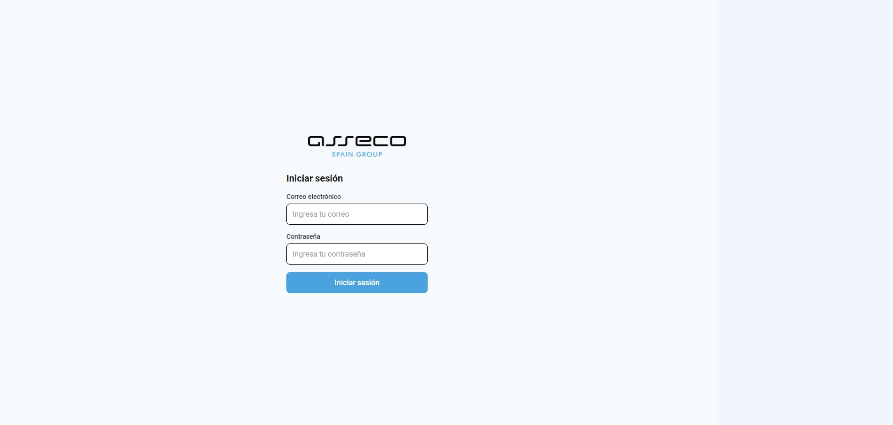
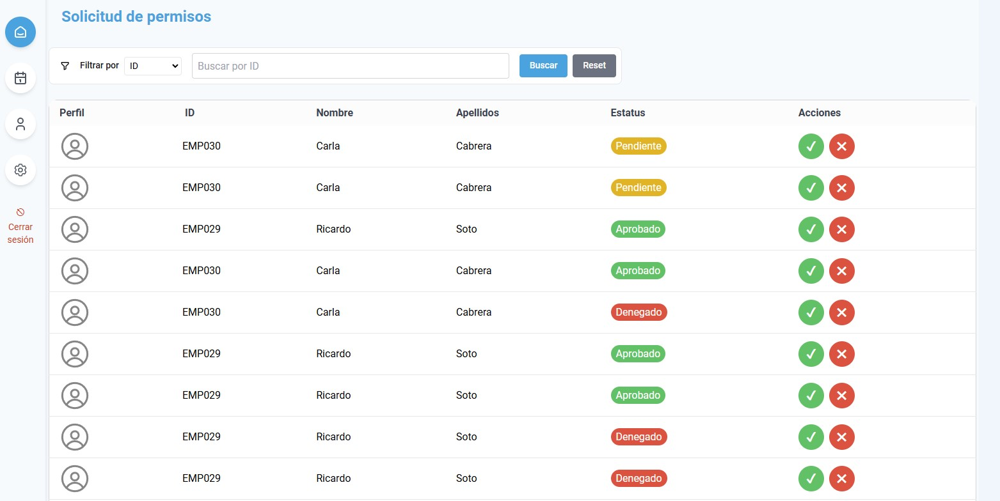
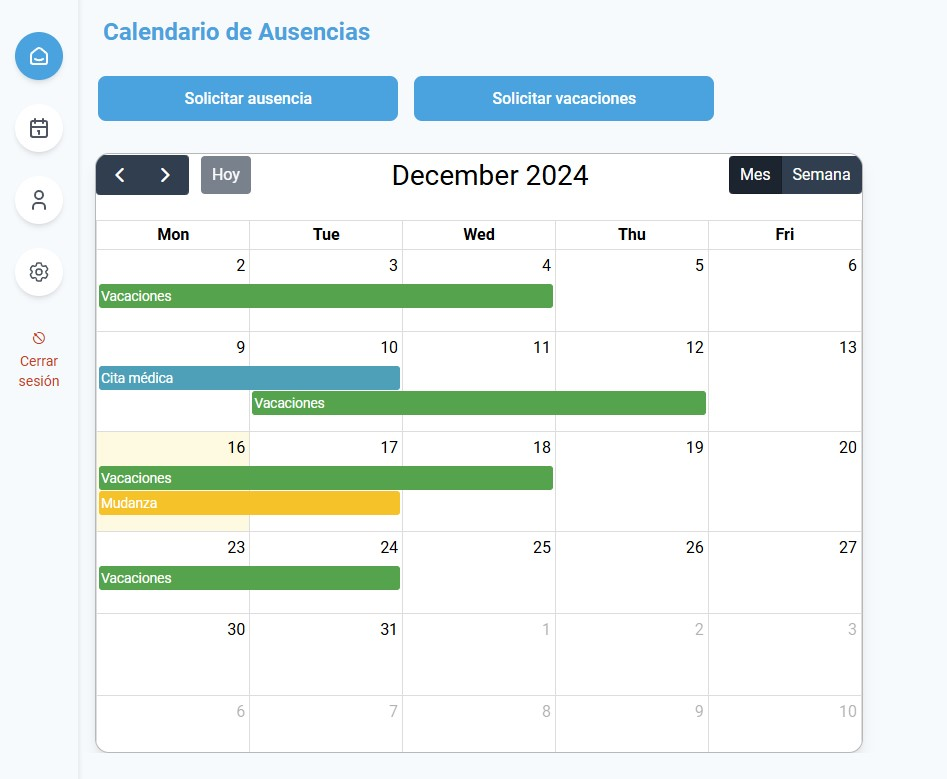
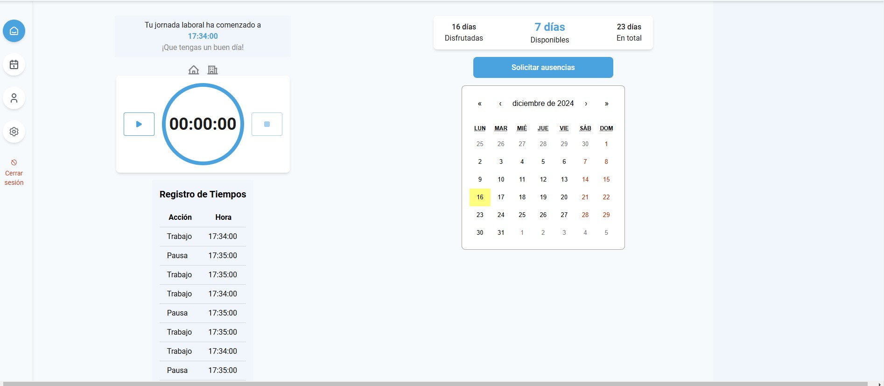
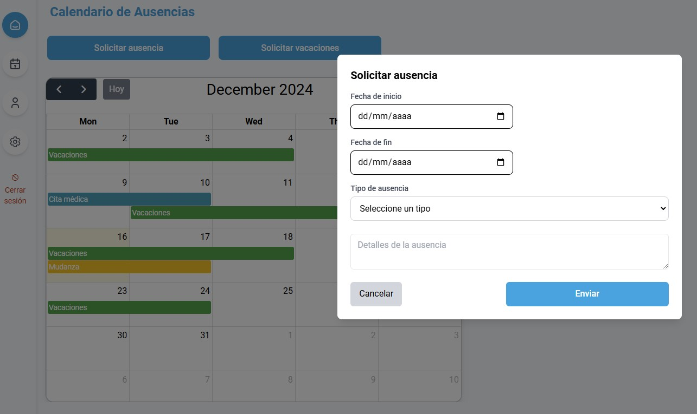
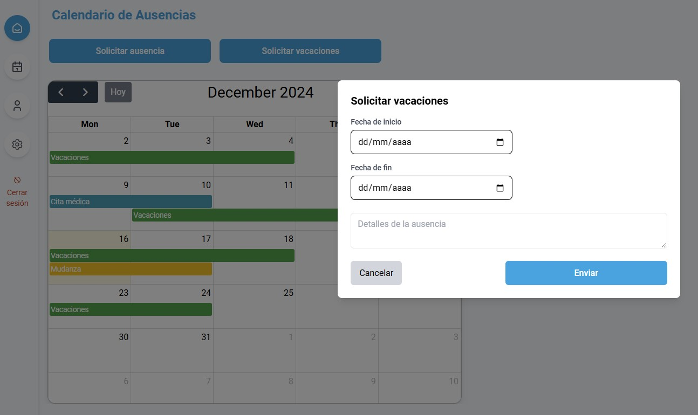
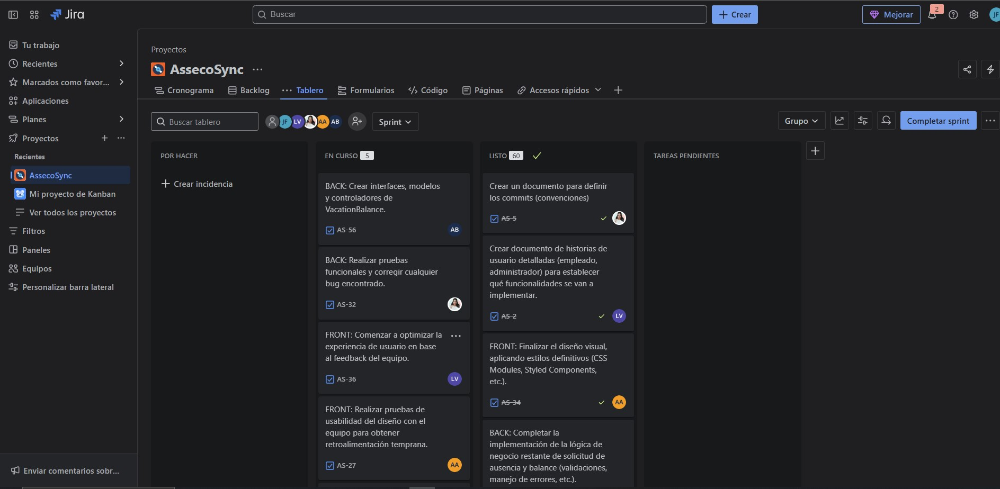

# AssecoSync🕐

**AssecoSync** es la solución ideal para gestionar el tiempo laboral en **Asseco**. Nuestra plataforma no solo facilita el registro horario, sino que también transforma la forma en que empleados y administradores gestionan vacaciones, ausencias y documentación laboral, promoviendo eficiencia y transparencia.



---

## Estructura del proyecto📁

Hemos separado el proyecto en dos repositorios:

- **[AssecoSync Cliente](https://github.com/LorelizDev/AssecoSync_client)**: Se enfoca exclusivamente en la interfaz de usuario (UI), lógica de presentación y experiencia del usuario.

- **[AssecoSync API](https://github.com/LorelizDev/AssecoSync_API)**: Se encarga de la lógica de negocio, almacenamiento de datos, autenticación, autorizaciones, y comunicación con la base de datos.

---

## Índice📞

1. [Descripción General](#descripción-general✨)
2. [Visión](#visión🌟)
3. [Público Objetivo](#público-objetivo👥)
4. [Tecnologías Usadas](#tecnologías-usadas💻)
5. [Características Principales](#características-principales✨)
6. [Instalación](#instalación🛠️)
7. [Capturas de pantalla](#capturas-de-pantalla📸)
8. [Documentación](#documentación📚)
9. [Futuras Mejoras](#futuras-mejoras🚀)

---

## Descripción General✨

**AssecoSync** es una aplicación web responsive que simplifica la gestión del tiempo laboral para empleados y administradores de **Asseco**. Permite registrar jornadas laborales, gestionar ausencias y vacaciones, y consultar reportes detallados, todo desde una interfaz moderna y amigable.

**Objetivo:**
Crear una plataforma integral que optimice procesos administrativos, garantizando eficiencia en el registro horario y mejora en la experiencia de los usuarios.

**Alcance de la versión inicial:**

- Registro horario.
- Gestión de vacaciones y ausencias.
- Panel de administración para Admin.

---

## Visión🌟

Proporcionar una herramienta tecnológica eficiente que mejore la experiencia del personal de **Asseco**, ofreciendo una gestión laboral clara, fácil y transparente.

---

## Público Objetivo👥

- **Empleados:** Gestionar su jornada laboral y vacaciones.
- **Administradores:** Supervisar y analizar el tiempo laboral y aprobar/rechazar las solicitudes.

---

## Tecnologías Usadas💻

### Frontend:

- : Biblioteca para construir interfaces interactivas.
- : Framework para diseño y estilos.
- : Para solicitudes HTTP.
- : Navegación en la aplicación.
- : Biblioteca para integrar calendarios interactivos.
- : Componente para gestionar eventos en el calendario.
- : Conjunto de iconos personalizables.
- : Biblioteca para mostrar notificaciones emergentes.
- : Librería para el manejo del estado global.
- : Herramienta para mostrar alertas personalizadas.
- : Herramienta para asegurar la calidad del código.
- : Pre-commit hooks para mantener estándares en el código.
- : Formateador de código para mantener consistencia.

### Herramientas:

- : Pruebas unitarias.
- : Gestión de tareas y proyectos.
- : Diseño de interfaces y prototipos.

---

## Características Principales✨

- **Registro horario:** Entrada y salida con modalidades presencial o teletrabajo.
- **Calendario:** Visualización de jornadas, vacaciones y festivos.
- **Panel de administración:** Supervisión y gestión de fichajes.
- **Gestión de solicitudes:** Aprobación/rechazo de vacaciones y ausencias.

---

## Instalación🛠️

Sigue estos pasos para instalar y configurar el proyecto:

1. **Clona el repositorio**:

   ```bash
   git clone https://github.com/LorelizDev/AssecoSync_client.git
   ```

2. **Instalar dependencias**:

   ```bash
   npm install
   ```

3. **Ejecutar el proyecto**:

   ```bash
   npm run dev
   ```

---

## Capturas de Pantalla📸

### Admin Solicitudes



### Calendario



### Dashboard Admin


### Dashboard



### Solicitar Ausencias



### Solicitar Vacaciones



### Jira



---

## Documentación📚

- [Documentación de Visión del Proyecto](src/docs/DOCUMENTO%20DE%20VISIÓN%20DEL%20PROYECTO.pdf)
- [Convención para la creación de ramas](src/docs/CONVENCION%20PARA%20LA%20CREACION%20DE%20RAMAS.pdf)
- [Plantilla de Prompts](src/docs/PLANTILLA%20DE%20PROMPTS.pdf)

---

## Futuras Mejoras🚀

- **Reportes avanzados:** Visualización gráfica de estadísticas laborales.
- **Integración con herramientas externas:** Sincronización con calendarios corporativos.
- **Gestor de roles:** Diferentes niveles de acceso y permisos.
- **Tests:** Finalizar los tests
- **Notificaciones:** Activar notificaciones sobre las solicitudes
- **Automatización fin de jornada:** Automatizar el control de jornada con notificaciones 30min antes de que acabe la jornada
- **Adjuntar Documentos:** Adjuntar documentos de justificantes para las ausencias

---

Gracias por confiar en **AssecoSync**. Nuestro compromiso es facilitar tu gestión laboral y optimizar tu tiempo. ¡Estamos para ayudarte!
